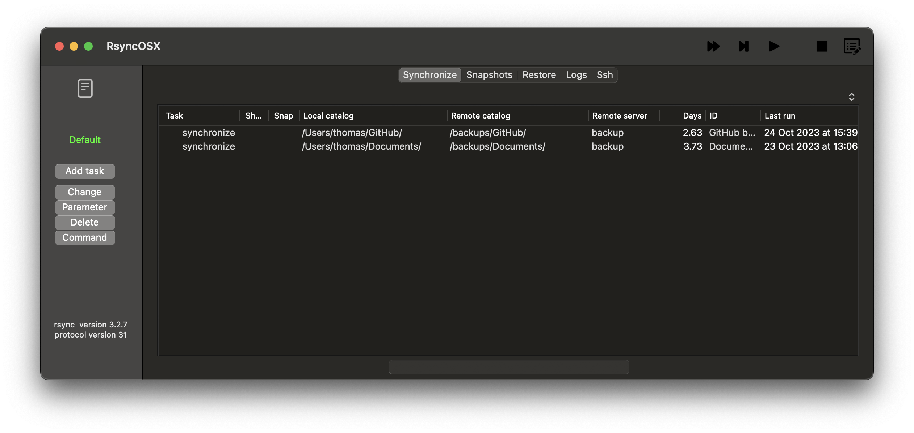
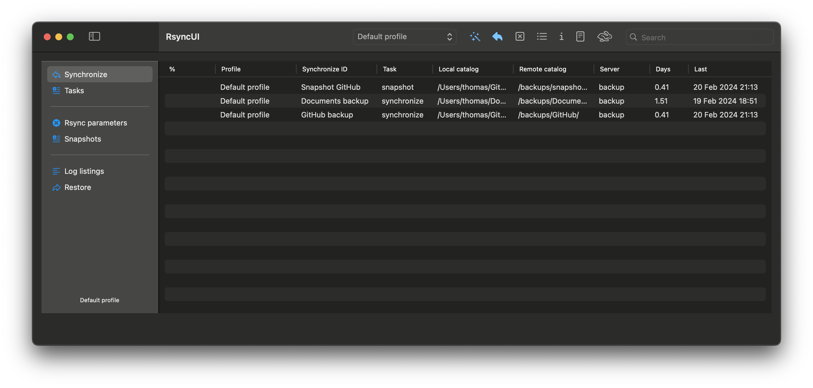

## Hi there 👋

RsyncOSX and RsyncUI are GUI´s on the Apple macOS plattform for the command line tool [rsync](https://github.com/WayneD/rsync). 

| App      | Lines & files | Code | Latest version  |  Version 1.0 | 
| ----------- | ----------- |   ----------- | -------- |  -------- |
| RsyncOSX   | about 11K, 121  | Storyboard, Swift, imperativ   | 6.8.0 - 13 April 2023 |	14 March 2016 | 
| RsyncUI   | about 14K, 168       | SwiftUI, Swift, declarativ     | 1.6.5 - 16 July 2023  | 6 May 2021  | 

It is `rsync` which executes the synchronize task. The GUI´s are only for setting parameters and make it more easy to use `rsync`, which is a fantastic tool.

### Install by Homebrew

Both apps might be installed by Homebrew

| App      | Homebrew | macOS |  Documentation |
| ----------- | ----------- |   ----------- |  ----------- |
| RsyncOSX   | `brew install --cask rsyncosx`  |  **macOS Big Sur** and later   |   [RsyncOSX](https://rsyncosx.netlify.app/post/rsyncosxdocs/) |
| RsyncUI   | `brew install --cask rsyncui`    | **macOS Monterey** and later     |   [RsyncUI](https://rsyncui.netlify.app/post/rsyncuidocs/) |

### Why two apps

The development of RsyncOSX commenced in 2015 as a private project to learn Swift. In 2019, Apple released SwiftUI, which is a development framework for building user interfaces for iOS, iPadOS, watchOS, TVOS, and macOS. SwiftUI quickly became very popular, and after some investigation, I decided to commence another private project to learn SwiftUI. The model part of RsyncOSX was at that time quite stable, and I decided to refactor the GUI part of RsyncOSX by utilizing SwiftUI. And that is the short story behind the two applications.

According to Apple, SwiftUI is the future. In my own experience, coding in SwiftUI is way easier and more predictable than in Storyboard and Swift, which are the basis for RsyncOSX. Both apps are maintained, but RsyncUI is the future, and all new development is within RsyncUI. And with every new release of macOS, Swift and Xcode there are new exciting features in SwiftUI.

Both apps might be used in parallel, but not at the same time due to the locking of files. Data is read and updated from the same location on storage.

### Important to verify

The UI of RsyncOSX and RsyncUI can for users who dont know `rsync` be difficult to understand. Setting wrong parameters to `rsync` can result in deleted data. RsyncOSX nor RsyncUI will not stop you for doing so. That is why it is **very** important to execute a simulated run, a `--dry-run`, and verify the result before the real run.

### External task executing rsync 

Please be aware it is an external task *not controlled* by RsyncOSX nor RsyncUI which [executes](https://github.com/rsyncOSX/RsyncUI/blob/main/RsyncUI/Model/Process/Main/Async/RsyncProcessAsync.swift) the command line tool `rsync`. The progress and termination of the external `rsync` task is monitored. The user can abort the task at any time. Please let the abort to finish and cleanup properly before starting a new task. It might take a few seconds. If not the apps might become unresponsive.

### Parameters to rsync

`rsync` supports a ton of parameters and most likely the advanced user of `rsync` wants to apply parameters and verify the effect. I am **not** an advanced user of `rsync`, but both RsyncOSX and RsyncUI supports adding parameters. 

### RsyncOSX

   

**RsyncOSX** is released for **macOS Big Sur** and later. Latest build is [13 April 2023](https://github.com/rsyncOSX/RsyncOSX/releases).

- the [documentation of RsyncOSX](https://rsyncosx.netlify.app/)
- the [readme for RsyncOSX](https://github.com/rsyncOSX/RsyncOSX/blob/master/RsyncOSX.md)
- the [changelog](https://rsyncosx.netlify.app/post/changelog/)

### RsyncUI

    

**RsyncUI** is released for **macOS Monterey** and later. Latest build is [16 July 2023](https://github.com/rsyncOSX/RsyncUI/releases).

- the [documentation of RsyncUI](https://rsyncui.netlify.app/)
- the [readme for RsyncUI](https://github.com/rsyncOSX/RsyncUI/)
- the [changelog](https://rsyncui.netlify.app/post/changelog/)

